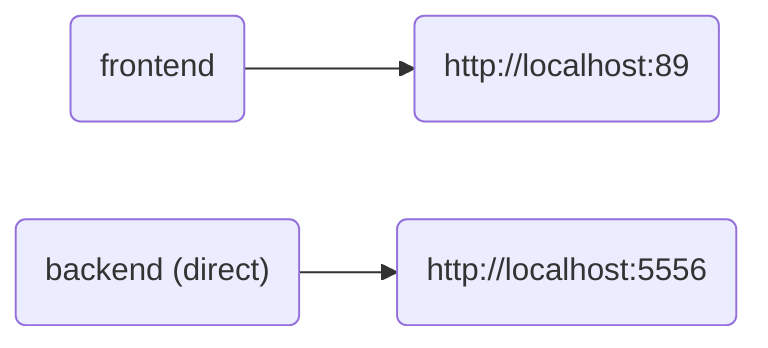

#  Sᴏʙᴇᴙ Tᴙᴀᴄᴋᴇᴙ

Choose a sober date and the date/time difference will be displayed

# Compose flowchart



---

# Development stuff

### Backend:

```bash
cd backend
uv lock
uv sync --extra dev
python api.py &
```

### Frontend:

```bash
cd frontend
pnpm i
pnpm run build:dev
```

# Docker stuff

### To build images:

```bash
# All
./build.sh

# Backend
cd backend && ./build.sh

# Frontend
cd frontend && ./build.sh
```