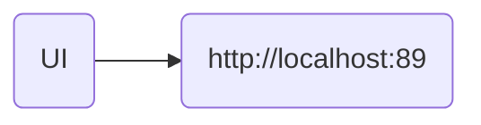
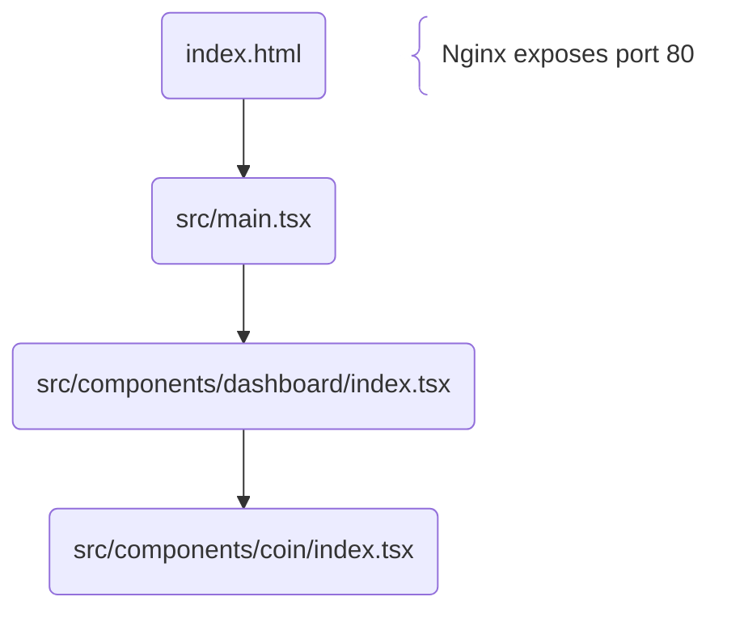

#  Sᴏʙᴇᴙ Tᴙᴀᴄᴋᴇᴙ

> Enter the day your recovery began to see your total sober time

---

### 🏗️ Architecture <!-- markdownlint-disable-line MD001 -->

#### Docker Compose Flow:



---

#### React Component Hierarchy:



---

### 🔗 Deep Linking

You can pre-load a specific date using a query parameter:

`?soberDate=YYYY-MM-DD`

---

### 🛠️ Environment Management

#### Node.js ([n](https://github.com/tj/n "n") manager):

|     📋 Task      |  🔧 Command   |
| :--------------: | :-----------: |
| Manage Versions  |      `n`      |
| Install Specific | `n [version]` |

#### NPM ([pnpm](https://github.com/pnpm/pnpm "pnpm") manager):

|   📋 Task    |          🔧 Command           |
| :----------: | :---------------------------: |
|    Enable    |    `corepack enable pnpm`     |
|     Use      |  `corepack use pnpm@latest`   |
| Use Specific | `corepack use pnpm@[version]` |
|    Update    |         `corepack up`         |

### 📦 Dependency Management

#### Installation & Removal:

|        📋 Task         |               🔧 Command (Full)                |        🔧 Command (Short)         |
| :--------------------: | :--------------------------------------------: | :-------------------------------: |
|      Install All       |                 `pnpm install`                 |             `pnpm i`              |
|   Install Prod Only    |             `pnpm install --prod`              |            `pnpm i -P`            |
|     Add dependency     |   `pnpm add --save-prod [package][@version]`   |  `pnpm add [package][@version]`   |
|   Add devDependency    |   `pnpm add --save-dev [package][@version]`    | `pnpm add -D [package][@version]` |
| Add optionalDependency | `pnpm add --save-optional [package][@version]` | `pnpm add -O [package][@version]` |
|   Add peerDependency   |   `pnpm add --save-peer [package][@version]`   |              &mdash;              |
|       Add Global       |    `pnpm add --global [package][@version]`     | `pnpm add -g [package][@version]` |
|   Remove Dependency    |            `pnpm remove [package]`             |        `pnpm rm [package]`        |

#### Maintenance & Quality:

|     📋 Task     |    🔧 Command (Full)    | 🔧 Command (Short)  |
| :-------------: | :---------------------: | :-----------------: |
|  Check Updates  |     `pnpm outdated`     |       &mdash;       |
|   Update All    |      `pnpm update`      |      `pnpm up`      |
| Update Specific | `pnpm update [package]` | `pnpm up [package]` |
| Security Audit  |      `pnpm audit`       |       &mdash;       |
|   Run Script    |   `pnpm run [script]`   |   `pnpm [script]`   |
|      List       |       `pnpm list`       |      `pnpm ls`      |
|   List Extra    |   `pnpm list --long`    |      `pnpm ll`      |
|    Hierarchy    |  `pnpm why [package]`   |       &mdash;       |

### 🧪 Development Scripts

|       📜 Script        |   🔧 Command (Full)    | 🔧 Command (Short) |
| :--------------------: | :--------------------: | :----------------: |
|        Lint All        |    `pnpm run lint`     |    `pnpm lint`     |
|        Lint CSS        |  `pnpm run lint:css`   |  `pnpm lint:css`   |
|       Run ESLint       | `pnpm run lint:eslint` | `pnpm lint:eslint` |
|       Lint HTML        |  `pnpm run lint:html`  |  `pnpm lint:html`  |
|     Lint Markdown      |   `pnpm run lint:md`   |   `pnpm lint:md`   |
|      Run Prettier      | `pnpm run lint:pretty` | `pnpm lint:pretty` |
| Run Tests (Hot Reload) |  `pnpm run test:dev`   |  `pnpm test:dev`   |
|     Run Tests (CI)     |    `pnpm run test`     |    `pnpm test`     |
|       Build Dev        |  `pnpm run build:dev`  |  `pnpm build:dev`  |
|       Build Prod       |    `pnpm run build`    |    `pnpm build`    |

#### Manual Deployment:

```bash
# Full build
./build.sh

# Docker build
./docker.sh
```

### 🛰️ Git & CI/CD

- **Pre-Commit:** Staged files are automatically linted and tested
- **Github Actions:** Automatically builds and pushes multi-arch images to repository
  - amd64
  - arm64
