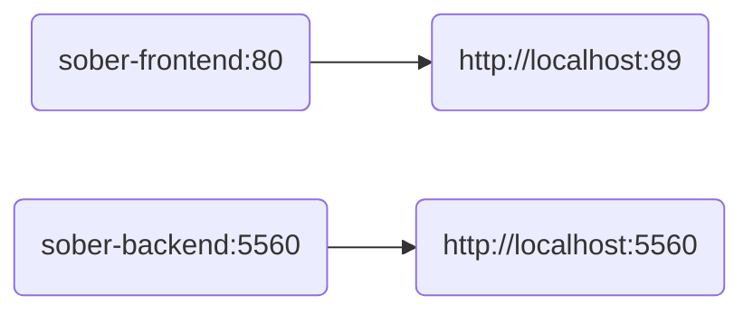

#  Sᴏʙᴇᴙ Tᴙᴀᴄᴋᴇᴙ

### Sobriety counter <!-- markdownlint-disable-line MD001 -->

---

<!-- cspell:disable -->


 &nbsp;
 &nbsp; <!-- markdownlint-disable-line MD013 -->

<!-- cspell:enable -->

---

### 🐳 Docker

#### Compose Flow:


```mermaid
flowchart LR
frontend@{shape: rounded, label: "sober-frontend:80"}
frontendPort@{shape: rounded, label: "http://localhost:89"}
backend@{shape: rounded, label: "sober-backend:5560"}
backendPort@{shape: rounded, label: "http://localhost:5560"}
frontend-->frontendPort
backend-->backendPort
```

#### Building Images:

```bash
./build.sh
```

---

### 📄 Documentation

#### Building:

```bash
./docs.sh
```

#### Links:

- [Frontend](./frontend/README.md "Frontend")
- [Backend](./backend/README.md "Backend")
