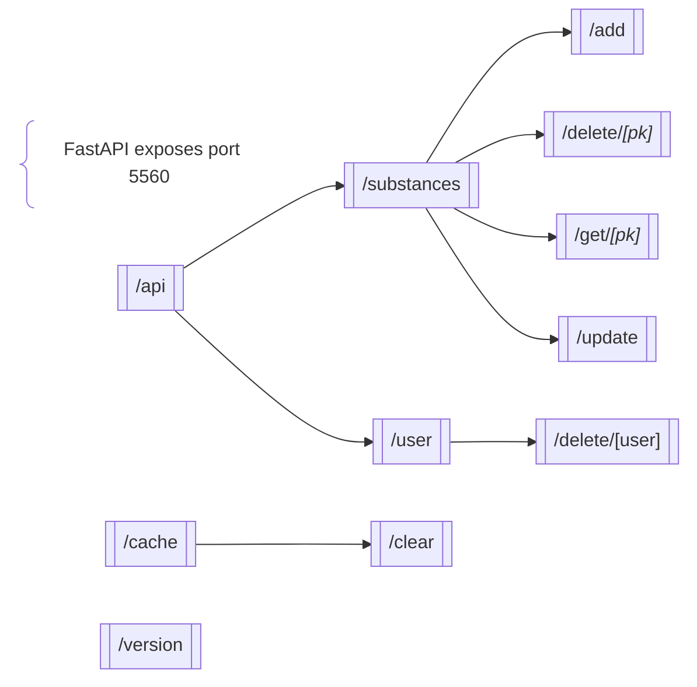

# ") Sᴏʙᴇᴙ Tᴙᴀᴄᴋᴇᴙ (Backend)

### Sobriety counter <!-- markdownlint-disable-line MD001 -->

---

<!-- cspell:disable -->

 &nbsp;
 &nbsp;
 &nbsp;
 &nbsp;
 &nbsp;

<!-- cspell:enable -->

---

### 🏗️ Architecture

#### API Structure:

```mermaid
flowchart LR
port@{shape: brace, label: "&nbsp; FastAPI exposes port 5560"}
api[["`/api`"]]
get_substances[["`/substances`"]]
add_substance[["`/add`"]]
delete_substance[["`/delete/*[pk]*`"]]
get_substance[["`/get/*[pk]*`"]]
update_substance[["`/update`"]]
get_user[["`/user`"]]
delete_user[["`/delete/[user]`"]]
get_cache_stats[["`/cache`"]]
clear_cache_stats[["`/clear`"]]
get_version[["`/version`"]]
api-->get_substances
get_substances-->add_substance
get_substances-->delete_substance
get_substances-->get_substance
get_substances-->update_substance
api-->get_user
get_user-->delete_user
get_cache_stats-->clear_cache_stats
```

---

### API Documentation

|  📄 UI  |  🌐 URL  |
|:-------:|:--------:|
| Swagger | `/docs`  |
|  ReDoc  | `/redoc` |
