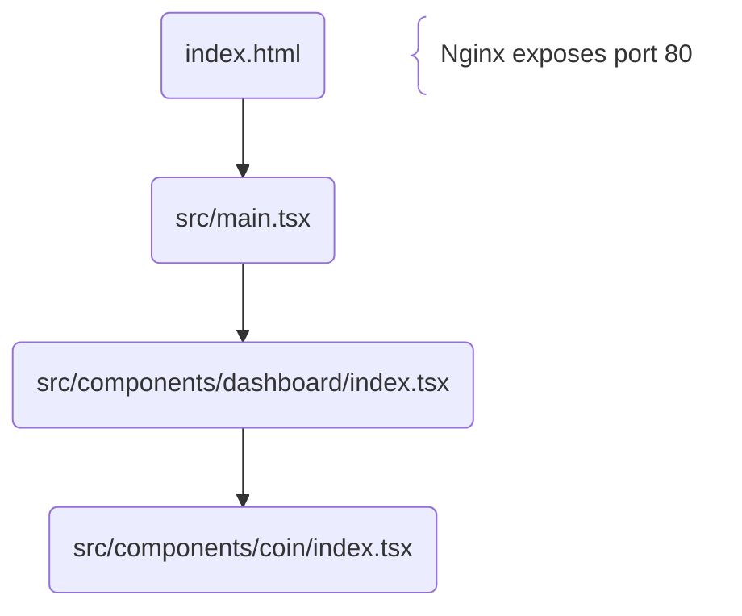

# Sᴏʙᴇᴙ Tᴙᴀᴄᴋᴇᴙ Frontend Flowchart



---

# PNPM stuff

### To enable PNPM:

```bash
corepack enable pnpm
```

### To update PNPM:

```bash
corepack up
# or
corepack use pnpm@latest
# or
corepack use pnpm@[version]
```

### To add dependency:

```bash
# devDependencies:
pnpm add -D [package][@version]
# or
pnpm add --save-dev [package][@version]

# depenencies:
pnpm add [package][@version]
# or
pnpm add --save-prod [package][@version]

# optionalDependencies:
pnpm add -O [package][@version]
# or
pnpm add --save-optional [package][@version]

# peerDependencies & devDependencies:
pnpm add --save-peer [package][@version]

# global:
pnpm add -g [package][@version]
# or
pnpm add --global [package][@version]
```

### To uninstall dependency:

```bash
pnpm rm [package]
# or
pnpm remove [package]
```

### To install dependencies:

```bash
# DEV:
pnpm i
# or
pnpm install

# PROD:
pnpm i -P
# or
pnpm install --prod
```

### To check for outdated dependencies:

```bash
pnpm outdated
```

### To update dependencies:

```bash
pnpm up
# or
pnpm update
```

### To audit dependencies:

```bash
pnpm audit
```

### To manually lint files:

```bash
pnpm run lint # runs eslint & prettier
# or
pnpm run lint:eslint
# or
pnpm run lint:prettier
```

### To manually build files:

```bash
pnpm run build:dev # DEV
# or
pnpm run build # PROD
```

### To run tests:

```bash
pnpm run test:dev # hot reloads
# or
pnpm run test # not interactive
```

### To run `package.json` script:

```bash
pnpm run [script]
```

# Node.js stuff

### To select/delete version:

```bash
sudo n
```

### To install version:

```bash
sudo n [version]
```
