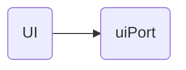
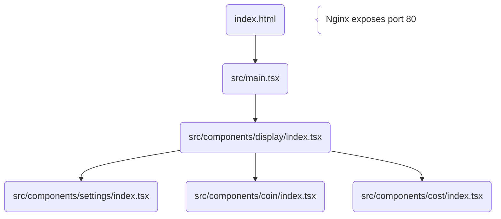

# ") Sᴏʙᴇᴙ Tᴙᴀᴄᴋᴇᴙ (Frontend)

### Sobriety counter <!-- markdownlint-disable-line MD001 -->

---

<!-- cspell:disable -->
 &nbsp;
 &nbsp;
 &nbsp;
 &nbsp; <!-- markdownlint-disable-line MD013 -->
![Valibot](https://img.shields.io/badge/Valibot-^1.4.2-informational?style=plastic&logo= "Valibot") &nbsp; <!-- markdownlint-disable-line MD013 -->


 &nbsp;

<!-- cspell:enable -->

---

### 🏗️ Architecture

#### Docker Compose Flow:


```mermaid
flowchart LR
ui@{shape: rounded, label: "UI"}
uiPort@{shape: rounded, label: ""}
ui-->uiPort
```

---

#### React Component Hierarchy:


```mermaid
flowchart TD
index(index.html)
main(src/main.tsx)
display(src/components/display/index.tsx)
settings(src/components/settings/index.tsx)
coin(src/components/coin/index.tsx)
cost(src/components/cost/index.tsx)
index-->main-->display
display-->settings
display-->coin
display-->cost
port@{shape: comment, label: "&nbsp; Nginx exposes port 80"}
```

---

### 🛠️ Environment Management

#### Node.js ([Bun](https://github.com/oven-sh/bun "Bun") manager):

| 📋 Task |  🔧 Command   |
|:-------:|:-------------:|
| Upgrade | `bun upgrade` |

### 📦 Dependency Management

#### Installation & Removal:

|        📋 Task         |            🔧 Command (Full)             |           🔧 Command (Short)           |
|:----------------------:|:----------------------------------------:|:--------------------------------------:|
|      Install DEV       |              `bun install`               |                `bun i`                 |
|      Install PROD      |        `bun install --production`        |               `bun i -p`               |
|     Add dependency     |      `bun add [package][@version]`       |      `bun a [package][@version]`       |
|   Add devDependency    | `bun add --save-dev [package][@version]` |     `bun a -d [package][@version]`     |
| Add optionalDependency | `bun add --optional [package][@version]` | `bun a --optional [package][@version]` |
|   Add peerDependency   |   `bun add --peer [package][@version]`   |   `bun a --peer [package][version]`    |
|       Add Global       |  `bun add --global [package][@version]`  |     `bun a -g [package][@version]`     |
|   Remove Dependency    |          `bun remove [package]`          |           `bun r [package]`            |

#### Maintenance & Quality:

|     📋 Task     |   🔧 Command (Full)    | 🔧 Command (Short)  |
|:---------------:|:----------------------:|:-------------------:|
|  Check Updates  |     `bun outdated`     |       &mdash;       |
|   Update All    |      `bun update`      |       &mdash;       |
| Update Specific | `bun update [package]` |       &mdash;       |
| Security Audit  |      `bun audit`       |       &mdash;       |
|  Package Info   |  `bun info [package]`  |       &mdash;       |
|   Run Script    |   `bun run [script]`   |   `bun [script]`    |
|      List       |       `bun list`       |       &mdash;       |
|   List Extra    |    `bun list --all`    |       &mdash;       |
|    Hierarchy    | `bun pm why [package]` | `bun why [package]` |

### 🧪 Development

#### Scripts:

|     📋 Task     |    🔧 Command (Full)    | 🔧 Command (Short) |
|:---------------:|:-----------------------:|:------------------:|
| Lint All (DEV)  |     `bun run lint`      |     `bun lint`     |
|  Lint All (CI)  |    `bun run lint:ci`    |   `bun lint:ci`    |
|   Lint Biome    |  `bun run lint:biome`   |  `bun lint:biome`  |
|    Lint CSS     |   `bun run lint:css`    |   `bun lint:css`   |
|    Lint ENV     |   `bun run lint:env`    |   `bun lint:env`   |
|    Lint HTML    |   `bun run lint:html`   |  `bun lint:html`   |
|  Lint Spelling  |  `bun run lint:spell`   |  `bun lint:spell`  |
|     Run DEV     |      `bun run dev`      |     `bun dev`      |
| Build/Run PROD  |     `bun run prod`      |     `bun prod`     |
|   Build PROD    |     `bun run build`     |      &mdash;       |
|      Test       |     `bun run test`      |      &mdash;       |
| Test w/Coverage | `bun run test:coverage` |      &mdash;       |

#### Docker Deployment:

| 📜 Script  |   🔧 Command   |
|:----------:|:--------------:|
|    Full    |  `./build.sh`  |
| Image Only | `./Dockerfile` |

---

### 📄 Documentation

#### Building:

```bash
./docs.sh
```

---

### 🛰️ Git & CI/CD

- **Pre-Commit:** Staged files are automatically linted and tested
- **Github Actions:** Lints, tests, builds, and pushes multi-architecture images to repository
  - latest
    - amd64
    - arm64
